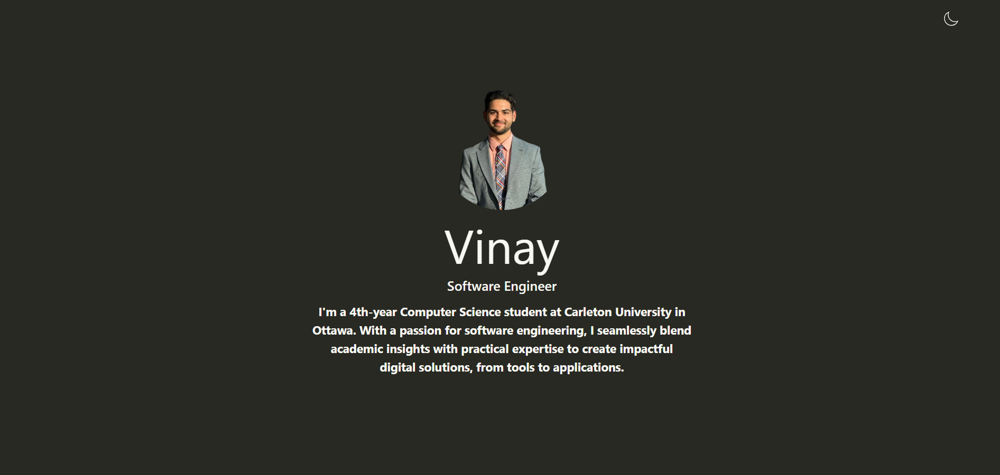

# Vinay's Portfolio Website

Hello there! 👋 Welcome to the repository of my personal [portfolio](https://portfolio.vinaycloud.ca). Here, you'll find the codebase that powers my personal space on the web. My portfolio showcases my projects, experiences, and a bit about who I am. 



## Technologies Used

- **Vite**: A build tool and development server that provides a faster and leaner development experience.
- **React**: A JavaScript library for building user interfaces.
- **TypeScript**: A superset of JavaScript that adds static types.
  
## Features

- Responsive design that looks great on both desktop and mobile.
- Dark mode for those who prefer a darker aesthetic.
- Interactive animations for a lively user experience.
- Detailed projects section to showcase my best work.

## Live Demo

[Visit my Portfolio](https://portfolio.vinaycloud.ca)

## Development

### Prerequisites

- Node.js
- npm or Yarn

### Setting Up & Running Locally

1. Clone the repository:

    ```bash
    git clone https://github.com/VinMeld/portfolio.git
    cd portfolio
    ```

2. Install dependencies:

    ```bash
    npm install
    ```

3. Start the development server:

    ```bash
    npm run dev
    ```

4. Open your browser and go to `http://localhost:<port number>`

## Deployment

The site is hosted on **Vercel**. Every push to the main branch triggers a deployment.

## Feedback

If you have any feedback or run into issues, please file an issue on this repository. If you like the repository, please consider giving it a ⭐!

## License

This project is open source and available under the [MIT License](LICENSE).

